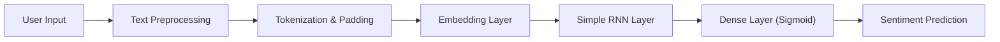

# IMDB Movie Review Sentiment Analysis
<p align="center">
  
  
  
  
</p>

An **end-to-end Deep Learning web application** that classifies movie reviews as **Positive** or **Negative** using a **Simple Recurrent Neural Network (RNN)** trained on the **IMDB Movie Reviews dataset**.
The model is deployed as an **interactive Streamlit web app**, covering the complete ML lifecycle from training to deployment.

## 📑 Table of Contents
- [Project Overview](#-project-overview)
- [Model & Application Architecture](#️-model--application-architecture)
- [Demo](#️-demo)
- [Features](#-features)
- [Tech Stack](#️-tech-stack)
- [Project Structure](#-project-structure)
- [How to Run the App Locally](#️-how-to-run-the-app-locally)
- [Future Improvements](#-future-improvements)
- [Credits](#-credits)
- [Contributing](#-contributing)
- [License](#-license)
---

## 📌 Project Overview

This project demonstrates how sequence-based neural networks can be applied to Natural Language Processing (NLP) tasks such as sentiment analysis. It emphasizes **correct preprocessing parity**, **robust inference**, and **production-ready deployment practices**.

Key highlights:

* Custom-trained Simple RNN using TensorFlow/Keras
* Careful handling of vocabulary limits and OOV tokens
* Streamlit-based UI for real-time sentiment prediction
* Designed with deployment and reproducibility in mind


## 🏗️ Model & Application Architecture

The application follows a standard NLP pipeline:



### Data Flow Explanation

1. **Input**
   User enters a raw movie review as free-form text.

2. **Preprocessing**

   * Text is lowercased
   * Split into tokens (words)

3. **Tokenization**

   * Words are mapped to integer indices using the IMDB vocabulary
   * Index offset of `+3` applied to match dataset conventions
   * Out-of-vocabulary (OOV) words handled safely

4. **Padding**

   * Sequences are padded/truncated to a fixed length of **500 tokens**

5. **Inference**

   * The trained Simple RNN outputs a probability score between `0` and `1`
   * Score ≥ 0.5 → **Positive**, otherwise **Negative**

---


## 🖥️ Demo

### Negative Sentiment Example:


### Positive Sentiment Example:


---

## ✨ Features

✔ Interactive and responsive Streamlit UI
✔ Real-time sentiment inference
✔ Confidence score and polarity visualization
✔ Example input buttons for quick testing
✔ Robust handling of unseen / rare words
✔ Deployment-safe TensorFlow model loading

---

## 🛠️ Tech Stack

**Python | TensorFlow (Keras) | Streamlit**

| Component     | Technology Used    |
| ------------- | ------------------ |
| Language      | Python 3.10+       |
| Model         | Simple RNN         |
| Deep Learning | TensorFlow / Keras |
| Frontend      | Streamlit          |
| Dataset       | IMDB Movie Reviews |
| Utilities     | NumPy              |

---

## 📁 Project Structure

```
├── app.py                      # Streamlit application (UI + inference)
├── Training_RNN.ipynb          # Model training notebook
├── sudha_simple_rnn_model.h5   # Trained Keras model
├── requirements.txt            # Project dependencies
├── README.md                   # Project documentation
```

---

## ▶️ How to Run the App Locally

### 1️⃣ Clone the Repository

```bash
git clone https://github.com/<your-username>/rnn-movie-review-sentiment-analysis.git
cd rnn-movie-review-sentiment-analysis
```

### 2️⃣ Install Dependencies

```bash
pip install -r requirements.txt
```

### 3️⃣ Run the Streamlit App

```bash
streamlit run app.py
```

---

## 🚀 Future Improvements

Potential extensions for this project:
* 🔹 Replace Simple RNN with **LSTM / GRU**
* 🔹 Add **Explainable AI** (word-level importance)
* 🔹 Enable **batch predictions** via file upload
* 🔹 CI/CD pipeline for automated deployment
* 🔹 Model comparison dashboard

---

## 👨‍💻 Credits
Developed by **Sudhanshu Kumar**
GitHub: [https://github.com/Sudhanshu480](https://github.com/Sudhanshu480)

Inspired by:
* Community best practices in ML deployment
* **Krish Naik’s Generative AI & Deep Learning course**

---

## 🤝 Contributing

Contributions are welcome!
Feel free to **fork the repository**, open an issue, or submit a pull request.

---

## 📜 License

This project is licensed under the **MIT License**.

---
